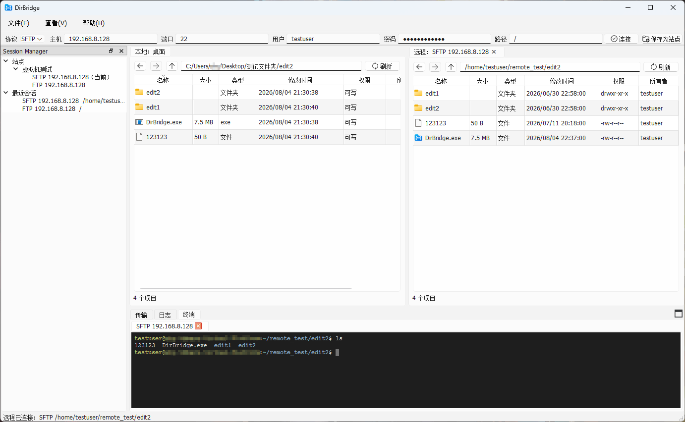

<p align="center">
  
</p>

<p align="center">
  <a href="https://github.com/shy117/DirBridge/releases/latest"></a>
  <a href="LICENSE"></a>
  
</p>

<p align="center">
  <strong>面向 Windows 的 FTP/SFTP 双栏文件管理与 SSH 终端工具</strong>
</p>

<p align="center">
  
</p>

DirBridge 面向 Windows 桌面场景，将本地与远程文件管理、文件传输、远程编辑和 SSH 终端整合在一个界面中。项目仍在持续开发，适合个人使用、功能体验和测试；操作重要数据前建议保留备份。

## 下载

前往 [GitHub Releases](https://github.com/shy117/DirBridge/releases) 下载 Windows x64 发布包：

- `DirBridge-vX.Y.Z-win64-setup.exe`：安装版，适合直接安装使用。
- `DirBridge-vX.Y.Z-win64.zip`：便携版，解压后运行 `DirBridge.exe`。

发布包已经包含 Qt、libcurl、MinGW 和 Ghostty VT 等随程序分发的运行组件，不需要配置源码构建环境。SSH 终端还需要 Windows 支持 ConPTY，并已安装系统 OpenSSH 客户端。

## 快速开始

1. 下载并安装程序，或解压便携版。
2. 在顶部连接栏输入 FTP/SFTP 服务器信息直接连接，或将常用连接保存为站点。
3. 在左侧会话管理器打开站点；中间本地面板和右侧远程面板可用于浏览、拖拽和文件操作。
4. 在底部“传输”页查看上传、下载和目录任务；SFTP 站点或远程会话可直接打开 SSH 终端。

保存站点时，密码使用 Windows 当前用户的数据保护能力加密存储。站点配置只对当前 Windows 用户可用，不应复制到其他账号或计算机作为明文凭据交换方式。

## 主要功能

### 文件管理

- 本地与远程双栏目录浏览。
- FTP/SFTP 站点保存、分组和多远程会话 Tab。
- 按站点恢复远程文件树显示状态。
- 新建文件和目录、删除、重命名及远程面板内移动。
- 查看和修改远程文件、目录权限，并可递归应用到子目录。
- 本地删除进入 Windows 回收站。

### 文件传输

- 上传、下载以及本地与远程面板间拖拽传输。
- 文件和多层目录传输。
- 全局传输队列、聚合进度、经过时间和任务取消。
- 传输列表刷新时保留滚动位置和任务选择。

### 远程编辑

- 使用 Windows 默认应用打开远程文件。
- 外部应用保存后自动同步回原远程路径。
- 编辑缓存、冲突检测和同步状态管理。

### SSH 终端

- 内嵌多标签 SSH 终端。
- 从 SFTP 站点或远程文件会话直接打开终端。
- 复用站点保存凭据，每个终端标签独立管理连接和生命周期。
- 支持 ANSI 颜色、滚动历史、选择复制、粘贴、中文输入和常用终端键盘操作。

## 平台与协议

| 项目 | 支持情况 |
|---|---|
| 操作系统 | Windows x64 |
| 远程文件协议 | FTP、SFTP |
| SSH 终端 | Windows ConPTY + 系统 OpenSSH 客户端 |
| 本地文件操作 | Windows 文件系统与回收站 |

## 技术栈

- C++17、Qt Widgets、CMake
- libcurl、nlohmann/json、spdlog
- Windows ConPTY、OpenSSH
- Ghostty VT 终端状态和输入编码运行库

## 从源码构建

构建要求：

- 64 位 Windows。
- CMake 3.24 或更新版本。
- Qt 5 或 Qt 6，并包含 Widgets 和 Svg 模块。
- 支持 C++17 `<filesystem>` 的编译器和标准库。

克隆仓库并准备第三方依赖：

```powershell
git clone https://github.com/shy117/DirBridge.git
Set-Location DirBridge
powershell -ExecutionPolicy Bypass -File scripts\setup_third_party.ps1
```

SSH 终端还需要与 `deps.lock.json` 匹配的 Ghostty VT 构建产物：

```powershell
powershell -ExecutionPolicy Bypass -File scripts\setup_ghostty_vt_local.ps1 -SourceRoot <Ghostty VT 构建输出目录>
```

使用 MinGW preset 配置和构建：

```powershell
cmake --preset windows-mingw-debug
cmake --build --preset windows-mingw-debug
```

默认构建产物位于：

```text
build/windows-mingw-debug/DirBridge.exe
```

公开仓库中的 `CMakePresets.json` 不包含本机 Qt 或编译器绝对路径。如相关工具不在默认搜索路径中，请创建不提交的 `CMakeUserPresets.json` 覆盖本机配置。

MSVC 构建推荐在 Visual Studio Developer PowerShell 中使用 vcpkg preset：

```powershell
cmake --preset windows-msvc-vcpkg-debug
cmake --build --preset windows-msvc-vcpkg-debug
```

依赖准备、ABI、vcpkg、运行时 PATH 和本机 preset 配置见 [CMake 依赖方案](docs/CMake依赖方案.md)。

## 已验证构建环境

| 环境 | 状态 |
|---|---|
| Windows + Qt 6 + MinGW | 主要开发和发布验证环境 |
| Visual Studio 2022 + Qt 6 MSVC + vcpkg `curl[ssh]` | 已验证构建和核心检查 |
| Visual Studio 2019 + Qt 5 MSVC 19.29 | 已验证构建和核心检查 |
| Qt 5 + MinGW | 计划保持兼容，仍需补齐完整验证 |
| GCC 7.3 / 旧版 MinGW | 不支持，缺少可用的 C++17 `<filesystem>` |

## 开发验证

构建完成后可运行：

```powershell
ctest --test-dir build\windows-mingw-debug --output-on-failure
.\build\windows-mingw-debug\DirBridge.exe --check-deps
.\build\windows-mingw-debug\DirBridge.exe --smoke-test
.\build\windows-mingw-debug\DirBridge.exe --ui-remote-smoke-test
.\build\windows-mingw-debug\DirBridge.exe --ui-remote-workflow-smoke-test
```

真实 FTP/SFTP 行为仍应在专用测试目录中验证，不要把服务器密码、Token 或其他凭据写入仓库。

## 文档

- [完整文档索引](docs/README.md)
- [总体技术方案](docs/00-总体技术方案.md)
- [架构与分层](docs/02-架构与分层.md)
- [远程文件外部编辑](docs/03-远程文件外部编辑.md)
- [版本记录](CHANGELOG.md)

## 参与贡献

欢迎通过 Issue 提交缺陷报告和功能建议，也欢迎围绕构建兼容性、远程文件操作、传输流程和 UI 体验提交改进。提交代码前，请运行与改动范围对应的构建、核心检查和 UI 工作流验证。

## 许可证

DirBridge 源码使用 [Apache License 2.0](LICENSE)。第三方库、终端运行库和图标资源遵循各自许可证，详见 [THIRD_PARTY_NOTICES.md](THIRD_PARTY_NOTICES.md)。
